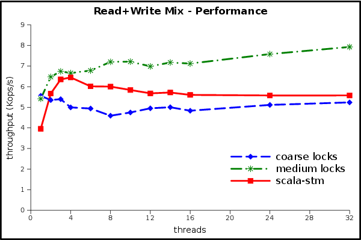
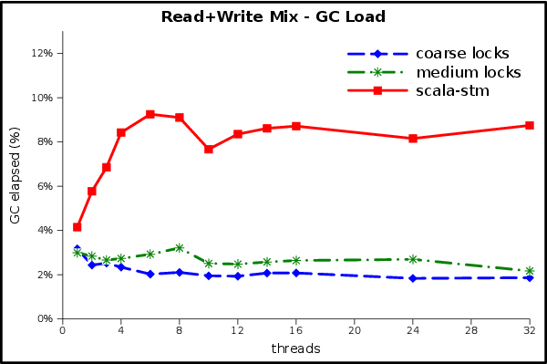

Benchmarking the reference implementation
-----------------------------------------

The primary goal of ScalaSTM's reference implementation is to implement
all of the features of the ScalaSTM API in pure Scala. It aims to be as
efficient for the general case while being robust to performance
pathologies (highly contended data, lots of threads, huge transactions,
...).

ScalaSTM implementations that perform bytecode rewriting or that use
`sun.misc.Unsafe` will be able to avoid some of the overheads inherent
in a library-only approach. Performance is a necessary feature even for
the reference implementation, though, so we:

-   include STM-friendly data structures (`TSet` and `TMap`) that reduce
    STM overhead (this helps for all implementations);
-   are careful to minimize object allocations;
-   block threads using `wait` and `notify`, rather than unbounded
    looping;
-   use internal data structures that can handle huge transactions; and
-   use a simple but complete contention management strategy.

TL;DR
-----

ScalaSTM is a bit slower than tricky locks when there is only one
thread, but it scales better.

STMBench7
---------

[STMBench7](http://lpd.epfl.ch/transactions/wiki/doku.php?id=stmbench7)
[^1]'[^2] is an STM benchmark that performs a mix of reads, writes, bulk
reads, and bulk writes over an in-memory representation of a CAD model.
Versions are available for C** and for Java. For comparison purposes the
benchmark comes with two locking strategies: coarse and medium. The
medium-grained locking implementation is representative of the approach
that an experienced parallel programmer might take (it is complicated
enough that early versions of the benchmark had concurrency bugs).

Rather than trying to compare the performance of one STM to another,
this experiment will compare ScalaSTM to simple (coarse) and complex
(medium) hand-rolled locking strategies.

Performance
-----------

Let's start with the read-dominated workload, which should benefit most
from the STM's optimistic locking. The test machine has 8 real cores
plus Hyper-Threading, so it can run 16 threads at once. We also tested
at higher thread counts to verify the robustness of the contention
management in `scala-stm`.

This result is excellent! STM has the same implementation complexity as
the coarse-grained lock (one big reader/writer lock), but it has much
better scalability. The single-thread overhead of STM is overcome even
at 2 threads. Despite being much more complicated (which means expensive
to write, test, and maintain) the medium-grained locks have a lower peak
performance than the simple STM code.

The write-dominated workload won't be as rosy, because there is not much
scalability to be found. Note the change in the units of the Y axis.

None of the implementations scale in this experiment. There is too much
writing for readers to get a benefit from optimistic concurrency or
reader/writer locks, and the writers touch the same data so often that
any benefits from parallelism are lost to cache misses and
synchronization overheads. The STM can't use scalability to compensate
for its single-thread overheads, but at least it is handling the
contention without any performance pathologies and with relatively low
overheads.

The read+write mixed workload should be better than the write-dominated
workload.

At first glance this looks more like the write-dominated performance
than the read-dominated one. Did something go wrong?

This graph shows the real-world effects of Amdahl's law. We can think of
the write-dominated component as the sequential part, since it doesn't
benefit from parallelism, and the read-dominated component as the
parallel part, since it gets faster when we add threads. 50% of the work
isn't scalable, so we will be limited to a speedup of 2. Even if reads
were completely free the mixed workload's *ops/sec* would only be double
the write-dominated workload's *ops/sec*.

We can estimate *sec/op* of the mix by average the *sec/op* of the two
component workloads (throughput is *op/sec*). Armed with this formula we
see that the mixed workload's performance is exactly as would be
expected from the previous two experiments.

Garbage collector load {#gc}
----------------------

There are several potential sources of extra GC load in the `scala-stm`
version of STMBench7:

-   allocation from the closures that help make the Scala code so
    pretty;
-   allocation in the STM itself (although for small- and medium-sized
    transactions the ScalaSTM reference implementation allocates only
    one object per transaction);
-   objects discarded when a transaction is rolled back and retried;
-   short-lived wrapper instances needed to use the generic `Ref`
    interface on the JVM (we may eventually target these with
    (specialized); and
-   copying performed during updates to the `immutable.TreeSet`, `TSet`
    and `TMap` used by the Scala version of the benchmark.

How much extra garbage is actually being generated?

This graph shows an estimate of the steady-state reclamation performed
by the GC during the benchmark, in gigabytes per second. The peak GC
throughput is 3 times higher for STM than for the medium-grained lock
implementation. That's a pretty big relative increase, but is the
absolute value of the numbers big or small?

Here we see the percentage of wall time taken by the GC. The ScalaSTM
implementation spends up to 9% of its execution time in the GC, compared
to 3% for the locking implementations. The benchmark represents a
worst-case scenario in which all threads spend all of their time in
transactions, so although there is an opportunity for further tuning
here it will only yield an incremental improvement.

*More GC graphs: read dominated [rate](images/stmbench7/r_gcrate.png),
[load](images/stmbench7/r_gcload.png); write dominated
[rate](images/stmbench7/w_gcrate.png),
[load](images/stmbench7/w_gcload.png).*

Details
-------

Experiments were run on a Dell Precision T7500n with two quad-core
2.66Ghz Intel Xeon X5550 processors, and 24GB of RAM. We used the Linux
kernel version `2.6.28-18-server`. Hyper-Threading was enabled, yielding
a total of 16 hardware thread contexts. Code was compiled with Scala
version 2.9.0-1. We ran our experiments in Sun's Java SE Runtime
Environment, build 1.7.0-b147, using the HotSpot 64-Bit Server VM with
default options. We used STMBench7 for Java version 1.2 (25.02.2011),
disabled long traversals, and did not count operations in which
`OperationFailedException` was thrown (this is the configuration used
previously by STM researchers).

Each data point is the average of 5 executions of the benchmark, each of
which lasted for 60 seconds. The ScalaSTM API, reference implementation
and STMBench7 adapter were compiled using git version
`33ebff7560855552f387d0618ddef208aa4b9191` of the [source](source.html).

If you're interested in digging deeper you can find implementations of
the mutable STMBench7 data model in the `scala-stm` source code at
[src/test/scala/stmbench7/scalastm](https://github.com/nbronson/scala-stm/tree/master/src/test/scala/stmbench7/scalastm),
and you can find the raw results and the spreadsheet that produced these
graphs in the `stmbench7_exp` git branch. You might also try adding
`-Dccstm.stats=true` to gather statistics about commit and rollback
rates, read and write set sizes, and more.

Conclusion
----------

This set of experiments shows that the reference implementation of
ScalaSTM can deliver good and robust performance in a system with lots
of synchronization. Our baseline was a carefully crafted lock
implementation that is substantially more complicated and subtle than
the STM version of the benchmark. The STM version generated several
times more work for the garbage collector, but still spent less than 9%
of time in the GC. ScalaSTM implementations that take advantage of more
aggressive techniques (such as bytecode rewriting) will be able to
deliver even better performance than the reference implementation, while
still delivering the same simplicity and composability advantages.

[^1]: R. Guerraoui, M. Kapalka, and J. Vitek. STMBench7: A Benchmark for
    Software Transactional Memory. In *EuroSys '07: Proceedings of the
    2nd ACM SIGOPS/EuroSys European Conference on Computer Systems*,
    pages 315--324, 2007.

[^2]: A. Dragojevic, R. Guerraoui, and M. Kapalka. Dividing
    Transactional Memories by Zero. In *Transact '08: 3rd ACM SIGPLAN
    Workshop on Transactional Computing*, 2008.
